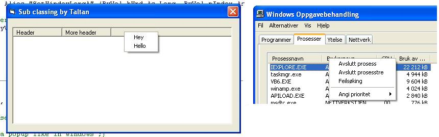



## Subclassing a right click event on the listview

### Description

Windows has it, but your application does not have it. Solve the ListView problem by Subclassing it!

We all know that mouse right click on the header in a listview isnt a standard event on the control. So, by subclassing it you can achieve that function.

It is very little code with commenting, so it will not be hard to learn. But if you do have any questions, dont hesitate and ask right away.
 
### More Info
 

             |
---                |---
**Submitted On**   |2004-05-29 11:44:02
**By**             |[Taltan](https://github.com/Planet-Source-Code/PSCIndex/blob/master/ByAuthor/taltan.md)
**Level**          |Intermediate
**User Rating**    |4.8 (19 globes from 4 users)
**Compatibility**  |VB 6\.0
**Category**       |[Windows API Call/ Explanation](https://github.com/Planet-Source-Code/PSCIndex/blob/master/ByCategory/windows-api-call-explanation__1-39.md)
**World**          |[Visual Basic](https://github.com/Planet-Source-Code/PSCIndex/blob/master/ByWorld/visual-basic.md)
**Archive File**   |[Subclassin1751415292004\.zip](https://github.com/Planet-Source-Code/taltan-subclassing-a-right-click-event-on-the-listview__1-54083/archive/master.zip)

